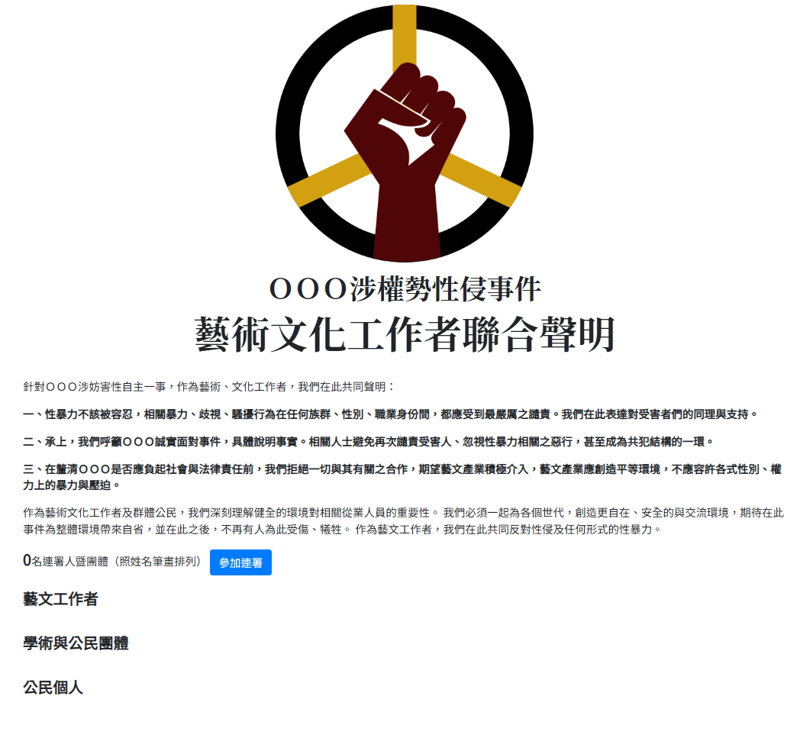

# metoo-petition

## 關於這個專案

在進行公民連署行動時，經常需要一個展示頁面，以顯示「目前的連署人數」以及「連署人的公民身份」。

一般而言，架設一個連署網站，需要有人開發前後端程式、處理網頁代管等事宜。除非有很強的技術背景知識，或是團隊中有這樣的幫手，否則很難在短時間將網站上線。

metoo-petition 這個小作品是 2022 年為了台灣某個 #MeToo 事件而撰寫的（這也是為何專案名稱會有 "metoo" 的原因）。在此將程式碼整理並釋出為開源專案，並提供了圖文教學。實務上您可將它改成任何主題，僅需修改連署議題和相關的說明文字即可。

**特性：**

* 快速建立一個簡易的連署展示頁面（10 分鐘以內）
* 以 Google 表單為基礎
* 無須安裝任何軟體，僅需有 Google 帳戶即可建立
* 無須具備任何後台開發建置經驗
* 適用於緊急、短期、預估幾千人的連署行動


## 專案說明

使用 metoo-petition，您只需要擁有一個 Google 帳戶，即可快速建立一個連署網站。它的運作方式如下：

透過 Google App Script 建立一個簡易的 WebApp，它會讀取由連署表單連結的試算表，然後在網頁上顯示連署者的資料。

```
    連署入口頁 (WebApp)                     連署表單
      +------------+                    +-------------+
      | index.html | ----(開啟連結)----> | Google Form |
      +------------+                    +-------------+
            |                                 |
            |                            (儲存連署資料)
   (讀取資料和生成網頁)                         |
            |                                 V
            |                     +--------------------+
            +-------------------> | google spreadsheet |
                                  +--------------------+
　　　　　　　　　　　　　　　　　　　　　　儲存連署人資訊
```

這個網頁可以顯示連署聲明，並顯示當前的連署人數，同時依據不同身份列出連署者的名稱（參見下圖）。




## 建置步驟

### 1. 建立一個 Google form 連署表單

表單包含兩個欄位：**你的身份**、**姓名**。 


### 2. 設定表單回覆儲存至 google 試算表

您無需手動建立試算表，只需在表單的回應設定中，將「選取回應目標位置」設定為一個新建立的試算表即可。


Google 試算表的內容如下。

注意：請確保欄位的順序，「您的身份」在第二欄，「姓名」在第三欄。如果順序不同，您需要調整程式碼，或者手動調換試算表的欄位。 


### 3. 建立 Google App Script

在 Google 雲端硬碟中，選擇「新增 -> 更多」，然後建立一個「Google Apps Script」。


在 Google Apps Script 的編輯畫面中，您需要建立三個檔案，其中包括一個**指令碼**以及兩個 **HTML** 檔案。建立方式如下圖所示：


### 4. 修改程式碼

預設情況下，Google App Script 會替你建立一個名為「程式碼.gs」的檔案，請用 [source/Code.gs](source/Code.gs) 的內容覆蓋它。

覆蓋後，您唯一需要手動修改的是程式碼中的第一行，即 Google 試算表的 ID。如下所示，您需要將 'YOUR_Spreadsheet_ID' 替換為實際的試算表 ID。

```javascript
var ss = SpreadsheetApp.openById('YOUR_Spreadsheet_ID');
```

Google 試算表的 ID 可以在回應表單的網址欄中找到（黃色框中）。


然後，繼續新增兩個 HTML 檔案：

* 將 [source/showData.html](source/showData.html) 的內容覆蓋您所建立的 showData.html
* 將 [source/index.html](source/index.html) 的內容覆蓋您所建立的 index.html

並且修改 index.html 中「參加連署」按鈕所指向的連結 — 將程式碼中 `https://docs.google.com/forms/d/e/YourFormID/viewform` 的連結替換為您 Google 連暑表單的連結。（href= 後面那段）

```html
  <a class="btn btn-primary" href="https://docs.google.com/forms/d/e/YourFormID/viewform" 
     role="button" target="_blank">參加連署</a>
```

### 5. 部署網頁應用程式

點擊「部署 -> 新增部署作業」


* 部署類型選擇「網頁應用程式（Deploy as Web App）」
* 執行身分選擇「我」
* 誰可以存取選「所有人」


然後，您需要驗證 Google 帳戶，輸入您的電子郵件和密碼以進行驗證和同意。完成部署後，您將獲得一個網頁應用程式的網址，這就是您的連署入口網頁。

注意：**每當修改程式碼或是網頁內容時，都需要重新部署**


### 6. 在瀏覽器中測試

以下是測試簽署五筆測試資訊後的結果。


如果您需要修改文字，請修改 index.html。此外，為了更容易分享您的連署入口網頁，您可能希望使用像 [Bitly](https://bitly.com/) 或 [TinyURL](https://tinyurl.com/) 這樣的短網址服務，將連署網頁的網址縮短。


## 貢獻＆聯絡

我並非專業的前後端開發者，這個小作品是我學習 Google App Script 時實作的，現在看起來依然有些缺點，像是無法避免建構者修改 HTML。

若您對此專案有任何點子、需求或錯誤回報，請隨時與我聯繫。亦歡迎任何開源社群的貢獻。

您可透過 [New issue](https://github.com/andrewintw/metoo-petition/issues) 功能開啟一個主題討論。有任何使用上的問題，亦可在這裡詢問。

## 授權

本專案程式碼的部分依據 [MIT License](LICENSE) 授權方式開源；文件的部分可依據 [CC BY-SA 4.0 DEED](https://creativecommons.org/licenses/by-sa/4.0/deed.zh-hant) 分享。
