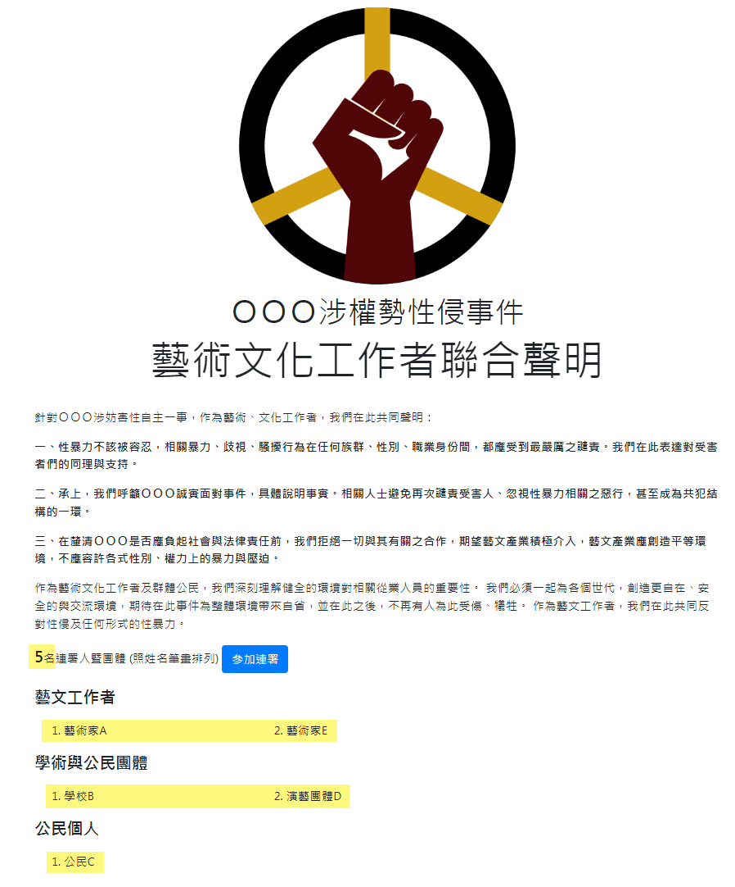
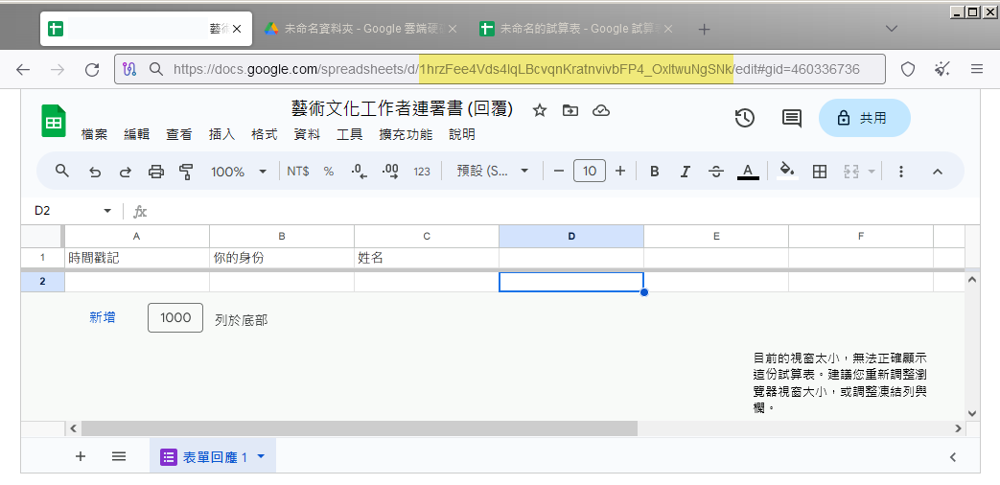

# metoo-petition

配合 Google 表單快速建立一個簡易的 #MeToo 連署網頁


## 專案說明

進行公民連署行動時，經常需要一個展示頁面，顯示目前的連署人數、以及公民身分。metoo-petition 這個小專案是 2022 年為了台灣某個 #MeToo 事件而撰寫的。現在把程式碼整理過開源，並附上圖文教學。

透過 metoo-petition 您只需有一個 google 帳戶就能快速建置一個連署網站。它的運作架構如下。透過 Google App Script，我們可以建立一個簡易的 WebApp，它會讀取由連署表單連結的試算表，並且把連暑人的內容顯示於網頁。

```
        連署入口頁                         連署表單
      +------------+                    +-------------+
      | index.html | ---(open link)---> | Google Form |
      +------------+                    +-------------+
            |                                  |
 (read data & generate web page)          (save data)
            |                                  |
            |                                  V
            |                     +--------------------+
            +-------------------> | google spreadsheet |
                                  +--------------------+
　　　　　　　　　　　　　　　　　　　　　　儲存連署人資訊
```

網頁可以顯示連署聲明，並且顯示目前的連署人數、依照不同的身分列出連署人的名字（如下圖）。




## 建置步驟

### 1. 建立一個 Google form 連署表單

表單包含兩個欄位：**你的身份**、**姓名**。 


### 2. 設定儲存表單回覆內容至 google 試算表

您不需要自行建立，只要在表單的回覆設定中「選取回應目標位置」至一個新建立的試算表（spreadsheet）即可。


google spreadsheet 的內容如下。

NOTE: 請注意欄位的順序，**你的身份**在第二攔，**姓名**在第三欄。若順序不同，就需要調整程式碼，或是手動將試算表的欄位對換即可。 


### 3. 建立 Google App Script

從雲端硬碟的「新增 -> 更多」建立一個「Google App Script」


您需要在 Google App Script 的編輯畫面中建立三個檔案，包含一個**指令碼**以及兩個 **HTML** 檔案。建立方式如下圖所示：


### 4. 修改程式碼

預設情況下，Google App Script 會替你建立一個名為「程式碼.gs」的檔案，請用 [source/Code.gs](source/Code.gs) 裡面的內容覆蓋它。

覆蓋後您唯一需要手動修改的是第一行的 Google 試算表的 ID，如下所示，你需要替換掉 `'YOUR_Spreadsheet_ID'`。

```javascript
var ss = SpreadsheetApp.openById('YOUR_Spreadsheet_ID');
```

Google 試算表的 ID 可以從回覆表單的網址列取得（黃色區塊）



然後，也將 [source/index.html](source/index.html) 的內容取代你所建立的 index.html；[source/showData.html](source/showData.html) 的內容取代你所建立的 showData.html


### 5. 部署網頁應用程式

點擊「部署 -> 新增部署作業」


* 部署類型選擇「網頁應用程式（Deploy as Web App）」
* 執行身分選擇「我」
* 誰可以存取選「所有人」


然後會需要你驗證 Google 帳戶，輸入您的 email 密碼驗證並同意即可。部署完成後會取得一個網頁應用程式的網址，這個 URL 就是連署的入口網頁。


NOTE: **每當修改程式碼或是網頁內容時，都需要重新部署**

### 6. 在瀏覽器中測試


